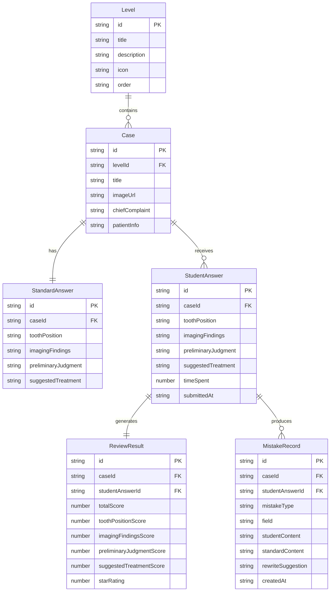

## 1. 架构设计

```mermaid
flowchart TD
    "A[前端 React SPA]" --> "B[路由层 React Router]"
    "B" --> "C[关卡选择页]"
    "B" --> "D[练习页]"
    "B" --> "E[批改页]"
    "B" --> "F[错题页]"
    "A" --> "G[状态管理 Zustand]"
    "G" --> "H[病例数据 Store]"
    "G" --> "I[答题进度 Store]"
    "G" --> "J[错题记录 Store]"
    "A" --> "K[本地存储 LocalStorage]"
    "K" --> "H"
    "K" --> "I"
    "K" --> "J"
```

纯前端应用，无后端服务。所有数据通过内置 Mock 数据集提供，用户进度和错题记录存储在 LocalStorage 中。

## 2. 技术说明

- **前端框架**：React@18 + TypeScript
- **样式方案**：Tailwind CSS@3
- **构建工具**：Vite
- **路由**：react-router-dom@6
- **状态管理**：Zustand
- **图标库**：lucide-react
- **字体**：Google Fonts（Noto Serif SC + Noto Sans SC）
- **后端**：无
- **数据库**：无，使用 LocalStorage 持久化用户数据

## 3. 路由定义

| 路由 | 用途 |
|------|------|
| `/` | 关卡选择页（首页），展示4大主题关卡和整体进度 |
| `/practice/:caseId` | 练习页，展示影像和报告填写表单 |
| `/review/:caseId` | 批改页，展示逐项比对和改写建议 |
| `/mistakes` | 错题页，按错误类型分类浏览和重做 |

## 4. API定义

不适用（纯前端应用，无后端API）

## 5. 服务端架构图

不适用

## 6. 数据模型

### 6.1 数据模型定义



### 6.2 数据定义

应用内置4个关卡、共10个病例的Mock数据集，存储在 `src/data/` 目录下：

- **关卡数据**：4个主题关卡（龋坏邻面片、根尖周病、阻生智齿、牙周骨吸收）
- **病例数据**：每个关卡2-3个病例，含脱敏影像URL、主诉、患者信息
- **标准答案**：每个病例的标准四栏答案
- **关键词库**：用于比对的关键词和评分规则
- **错误类型**：漏写牙位、描述顺序不清、影像表现写成确诊、建议处理不当

错误检测规则：
1. **漏写牙位**：标准答案中的牙位关键词在学生答案中未出现
2. **描述顺序不清**：学生答案中关键词出现顺序与标准答案差异较大
3. **影像表现写成确诊**：在"影像所见"栏中出现诊断性用语（如"龋坏""根尖周炎"）而非描述性用语（如"低密度影""透射影"）
4. **建议处理不当**：在"建议处理"栏中的处理方案与标准答案不匹配

LocalStorage 持久化：
- `dental-progress`：关卡完成状态、得分、星级
- `dental-mistakes`：错题记录列表
- `dental-answers`：历史答题记录
